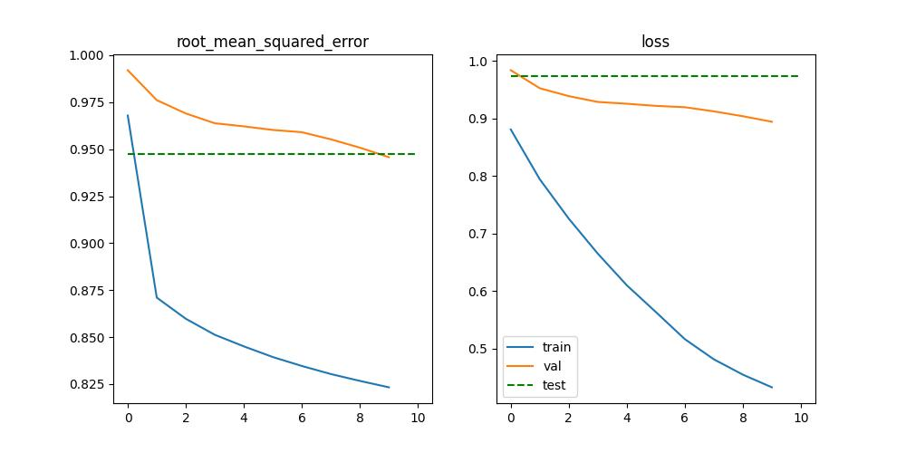

Topics
------
- Data Science
- Machine Learning Engineering
- MLOps


Table of Contents
--------
1. Overview
2. Data
3. Model architecture
4. Model training
5. Model evaluation
   1. Iteration I
6. Locally package building
7. AWS CodeArtefacts package building 
8. CI/CD
9. Remove AWS components

### 1. Overview

The project shows how to build a <b>modern recommendation system</b> based on the architecture of neural networks.
<br><br>The goals of the project are:
- Train the recommendation engine
- Structure the project 
- Train the model
- Build the PyPi package locally
- Build the PyPi package in AWS CodeArtefacts
- Build CI/CD pipeline for building PyPi package in the AWS 

This is the first of two parts. The second part of the project will be in a separate repository and will concern building a <b>Flask REST API</b> that will share predictions from the model. 

### 2. Data

Data source: https://grouplens.org/datasets/movielens/20m/

The data includes information on 5-star ratings derived from the movie recommendation system

Important datasets:
* ratings.csv columns: userId,movieId,rating,timestamp
* movies.csv columns: movieId,title,genres
 
### 3. Model architecture

Model consists of two stages:
* Retrieval Stage - efficiency select hundreds of candidates from millions of candidates
  * ./src/model/retrieval.py
  * ./src/training/train_retrieval.py
* Ranking Stage - predict user ranking for hundreds of candidates and order by scoring
  * ./src/model/ranking.py
  * ./src/training/train_ranking.py
  
[](https://mermaid.live/edit#pako:eNpV0D0PgjAQBuC_0tykCZK4Mpj4OemCI2W40BMaaUtKS6LAf7coJtrp8t7TvE17KIwgSKC02FTsnHLNwtlmF9NJYoWxjW9ztlptBiVraXQ7sN0iJWcldVizq8OSlp9Lu4mxofJaWBIB7hcp6rvU5R_bv9lhbljnv-kxi-P4NxmEedJUepq9fm8hAkVWoRTh6f2UcHAVKeKQhFGgvXPgegzONwIdHYV0xkJyw7qlCNA7c33oAhJnPX3RQWL4BjWr8QWBvVqg)

### 4. Model training

Check config.yml file specification and make sure the training parameters are set properly.

Download data, prepare data, train both models and test:
```commandline
tox
```

Train one model:
```commandline
tox -e train_retrieval 
tox -e train_ranking
```

### 5. Model evaluation

* <b>Iteration I</b> <br>
Assumptions:
  * 5% of observations
  * retrieval ::
    epochs: 10
    user_embedding_dim: 32
    title_embedding_dim: 25
    title_text_embedding_dim: 7
    layer1: 16
    layer2: 8
    scann_k: 15

  * ranking ::
    epochs: 10
    user_embedding_dim: 32
    movie_embedding_dim: 32
    layer1: 32
    layer2: 16

Retrieval model


Test metric:
* top 100 categorical accuracy = 7%

Ranking model



Test metric:
* RMSE = 0.98


### 6. Locally package building

Build package locally:
```commandline
python3 -m pip install --upgrade build
python3 -m build
```

Install package to local PyPi repository:
```commandline
pip install ./dist/recsysmodel-0.0.1-py3-none-any.whl
```

Check package:
```python
from recsysmodel.scoring.predict import predict
user_id = 20
# Recomendations for user 20
rec = predict(20)
print(rec)

Results:
[b'Wallace & Gromit: A Close Shave (1995)', b'Gattaca (1997)', b'Thing, The (1982)', b'Cube (1997)', b'Black Orchid, The (1958)'], [4.351129531860352, 4.121507167816162, 4.089163303375244, 3.755620241165161, 3.7031068801879883])
```

### 7. AWS CodeArtifacts package building 

Create AWS CodeArtifact components using AWS CLI.
Required env variables:
* AWS_ACCOUNT_ID
* AWS_SECRET_ACCESS_KEY_ID
* AWS_ACCESS_KEY

```commandline
aws codeartifact create-domain --domain cloud-pypi-repo
aws codeartifact create-repository --domain cloud-pypi-repo --domain-owner $AWS_ACCOUNT_ID --repository recsysmodel
```

Results in AWS.


Deploy package to AWS.

```commandline
export TWINE_USERNAME=aws
export TWINE_PASSWORD=`aws codeartifact get-authorization-token --domain cloud-pypi-repo --domain-owner ${{ secrets.AWS_ACCOUNT_ID }} --query authorizationToken --output text`
export TWINE_REPOSITORY_URL=`aws codeartifact get-repository-endpoint --domain cloud-pypi-repo --domain-owner ${{ secrets.AWS_ACCOUNT_ID }} --repository recsysmodel --format pypi --query repositoryEndpoint --output text`
python setup.py sdist bdist_wheel
twine upload dist/*
```

Results in AWS.


### 8. CI/CD

Create github action yaml file and create github repository secrets.

```yaml
name: RecSysModel Package
on:
  push:
    branches:
      - main
jobs:
  deploy:
    runs-on: ubuntu-latest
    steps:
      - uses: actions/checkout@v2
      - uses: actions/setup-python@v2
        with:
          python-version: '3.8'
      - name: Install dependencies
        run: |
          python -m pip install --upgrade pip
          pip install setuptools wheel twine
      - uses: aws-actions/setup-sam@v1
      - uses: aws-actions/configure-aws-credentials@v1
        with:
          aws-access-key-id: ${{ secrets.AWS_ACCESS_KEY_ID }}
          aws-secret-access-key: ${{ secrets.AWS_SECRET_ACCESS_KEY }}
          aws-region: eu-central-1
      - name: Build and publish
        run: |
          export TWINE_USERNAME=aws
          export TWINE_PASSWORD=`aws codeartifact get-authorization-token --domain cloud-pypi-repo --domain-owner ${{ secrets.AWS_ACCOUNT_ID }} --query authorizationToken --output text`
          export TWINE_REPOSITORY_URL=`aws codeartifact get-repository-endpoint --domain cloud-pypi-repo --domain-owner ${{ secrets.AWS_ACCOUNT_ID }} --repository recsysmodel --format pypi --query repositoryEndpoint --output text`
          python setup.py sdist bdist_wheel
          twine upload dist/*
```

### 9. Remove AWS Components

If you've created domain and repository for educational purpose don't forget to clean.

```commandline
aws codeartifact delete-repository --domain cloud-pypi-repo --domain-owner $AWS_ACCOUNT_ID --repository recsysmodel
aws codeartifact delete-domain --domain cloud-pypi-repo --domain-owner $AWS_ACCOUNT_ID
```  